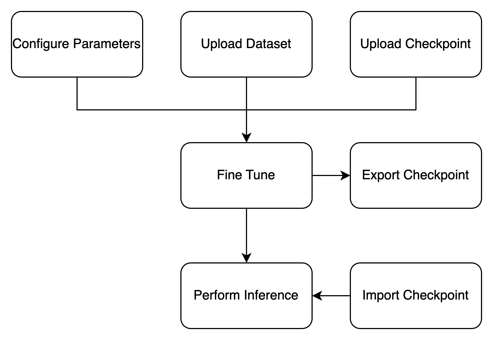
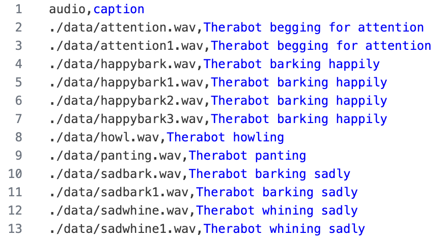

Usage
=====

This section describes how to use the AudioLDM2 fine-tuning pipeline and interface for fine-tuning and audio generation. This section reflects the interface in version `1.9.2.1 <https://hub.docker.com/repository/docker/jytole/runpod_audioldm/tags/1.9.2.1/sha256-3d6570b303fb9f8d0cf23a367407e4c168696e5f8ee01474966c81020e92673a>`_ of the Docker container as of April 18, 2025.

The system is designed to be run in a container, as described in the Installation section, with an exposed web port to access the hosted flask application. When hosted on RunPod, it is possible to access the http interface from the `RunPod console <https://www.runpod.io/console/pods>`_ with the "connect" button on the pod.

Process Overview
-----------------
The AudioLDM2 pipeline and interface is intended to be used to either fine-tune the AudioLDM2 model, or to generate audio from a previously fine-tuned model. The process is thus divided into two main sections: fine-tuning and audio generation. In order to fine-tune, a checkpoint of AudioLDM2 and a dataset in .zip format are needed as input. A checkpoint of AudioLDM2 is included in the suggested docker container. In order to generate sounds, a checkpoint of AudioLDM2 is needed as input. A flowchart of the process is shown below.

Fine-Tuning
----------------
In order to initiate the fine-tuning process, the user must upload a dataset in .zip format and select a checkpoint of AudioLDM2. The dataset must be in the format specified in the Dataset Formatting subsection below. The following steps should be followed to fine-tune the model:

1. **Prepare Dataset**: The dataset must be in .zip format and follow the guidelines in the Dataset Formatting subsection below.
2. **Upload Dataset**: The dataset can be uploaded using the "Choose File" button in the interface. "Submit" once the file is uploaded.
3. **Select Checkpoint**: The checkpoint can be selected from the dropdown menu in the "Start Fine-Tuning" field.
4. **Adjust Parameters**: The parameters for the fine-tuning process can be adjusted in the "Options" tab and are discussed in the "Parameters" section below.
5. **Start Fine-Tuning**: Click the "Start" button in the "Start Fine-Tuning" field to begin the fine-tuning process. 
6. **Monitor Progress**: The progress of the fine-tuning process can be monitored at the top of the page in the "AudioLDM2 Monitor" field.

Import Files from Cloud Storage
^^^^^^^^^^^^^^^^^^^^^^^^^^^^^^^^^^
In order to speed up the process of uploading large files like the dataset or the checkpoint, the interface can scan for datasets and checkpoints that have been manually transferred to the container. RunPod supports transferring files from cloud storage. If a checkpoint is placed into the /home/AudioLDM-training-finetuning/webapp/static/checkpoints/ directory, it can be detected and added to the checkpoint dropdown menu. Similarly, if a dataset is placed into the /home/AudioLDM-training-finetuning/webapp/static/datasets/ directory, it can be detected and added to the dataset dropdown menu. The interface will then allow the user to select these files from the dropdown menus instead of uploading them.

In order to initiate this transfer and allow the interface to detect the files, you can refer to the `RunPod documentation <https://docs.runpod.io/pods/configuration/export-data>`_ on transferring files between the container and cloud storage. Ensure that you are transferring checkpoints with the extension .ckpt into the ./webapp/static/checkpoints/ directory, and datasets with the extension .zip into the ./webapp/static/datasets/ directory.

In order to tell the interface to detect the files, there is a scan button on the Options page. This will scan the directories and add any files that are found to the dropdown menus.

Dataset Formatting
^^^^^^^^^^^^^^^^^^^^^
The dataset must be in .zip format and contain all the audio files. The audio files must be in .wav format. The audiofiles may be in a subdirectory. The dataset must also contain a .csv file with columns for "audio" and "caption". The "audio" column must contain the relative path to an audio file from the root of the dataset. The caption should be a description of the contents of the audio file for use in training. The .csv file must be named metadata.csv and be located in the root of the dataset. An example dataset might be structured as follows:

.. image:: images/datasetStructure.png
   :align: center
   :width: 25%
   :alt: AudioLDM2 Dataset Structure

The metadata.csv file for this dataset would look like this:

Accessing checkpoints
^^^^^^^^^^^^^^^^^^^^^^^^^^^^
The fine-tuning page of the interface contains a button to download the latest checkpoint, but this 8 GB download may take a significant amount of time, so it is recommended to export the checkpoint to cloud storage according to the `RunPod documentation <https://docs.runpod.io/pods/configuration/export-data>`_.

You may find checkpoints in the /home/AudioLDM-training-finetuning/log/latent-diffusion/ directory. By default within this directory, the checkpoint is located in ./2025_03_27_api_default_finetune/default_finetune/checkpoints/. The latest checkpoint should be saved with the "global step" count labeled in the filename. By default, the checkpoint is saved every 5000 global steps, but this parameter can be adjusted in the options tab.

Manually Stop Fine-Tuning
^^^^^^^^^^^^^^^^^^^^^^^^^^^^

With the default configuration parameters, fine-tuning may take a long time depending on the size of the dataset and the parameters configured. If you would like to stop the fine-tuning process, it is recommended to first export the latest checkpoint according to the instructions above before stopping the process. This checkpoint can then be imported to generate sounds.

Fine-tuning can be stopped by searching for the process running "python torchServer.py" in the container and killing the process with the lowest process ID. This can be done with the following commands:

.. code-block:: console

   (audioldm_train) $ ps aux | grep torchServer.py
   (audioldm_train) $ kill <process_id>

It is recommended to also kill the process running "gunicorn" int he container, as this process should be running alongside the webapp. Follow the same process as above to find the process ID and kill it. The commands should look like this:

.. code-block:: console

   (audioldm_train) $ ps aux | grep gunicorn
   (audioldm_train) $ kill <process_id>

Once this process is killed, the system may be rebooted to start it again, or the webapp script may be restarted manually without rebooting using the following commands:

.. code-block:: console

   (audioldm_train) $ export FLASK_SECRET_KEY=$(openssl rand -hex 16)
   (audioldm_train) $ /post_start.sh

Generating sounds
-----------------
In order to generate sounds using the AudioLDM2 interface, the inference tab can be used. The dropdown box inside the Generate Sound section of the interface should be used to select the desired checkpoint to generate sounds from. The text box should be used to input a prompt, and “Submit” can be pressed to generate a sound.

For example, “Therabot barking” could be used as a prompt for a checkpoint trained on sounds labeled with “Therabot” in order to generate a sound similar to those that were used in training.

Parameters
-----------------
The following parameters are available in the Options tab to change the way that the model behaves. A short description of each parameter is included.

- Seed

    - Default: 0
    - Changes the seed for random number generation. 
    - The same seed with the same prompt and the same checkpoint will generate the same sound.

- Save Checkpoint Every N Steps

    - Default: 5000
    - Number of global steps after which to save a checkpoint

- Validation Every N Epochs

    - Default: 5
    - Number of epochs after which to perform the validation loop
    - The validation loop performs inference and adjusts the learning rate according to results

- Evaluation: Unconditional Guidance Scale

    - Default: 3.5
    - A lower value indicates more creativity
    - A higher value indicates less creativity and more obedience to the prompt
    - It is not recommended to go above 15

- Evaluation: DDIM Sampling Steps

    - Default: 200
    - Denoising steps
    - More steps means a clearer sound
    - After around 50 steps, the increase in clarity is less substantial up to 200 steps (according to the original AudioLDM paper)

- Evaluation: N Candidates Per Sample

    - Default: 3
    - Number of sounds to generate during inference before taking the top candidate

Interface images
-----------------

.. image:: images/finetuneInterface.png
   :align: center
   :alt: AudioLDM2 Fine-Tuning Interface

.. image:: images/inferenceInterface.png
   :align: center
   :alt: AudioLDM2 Generation Interface

.. image:: images/optionsInterface.png
   :align: center
   :alt: AudioLDM2 Options Interface